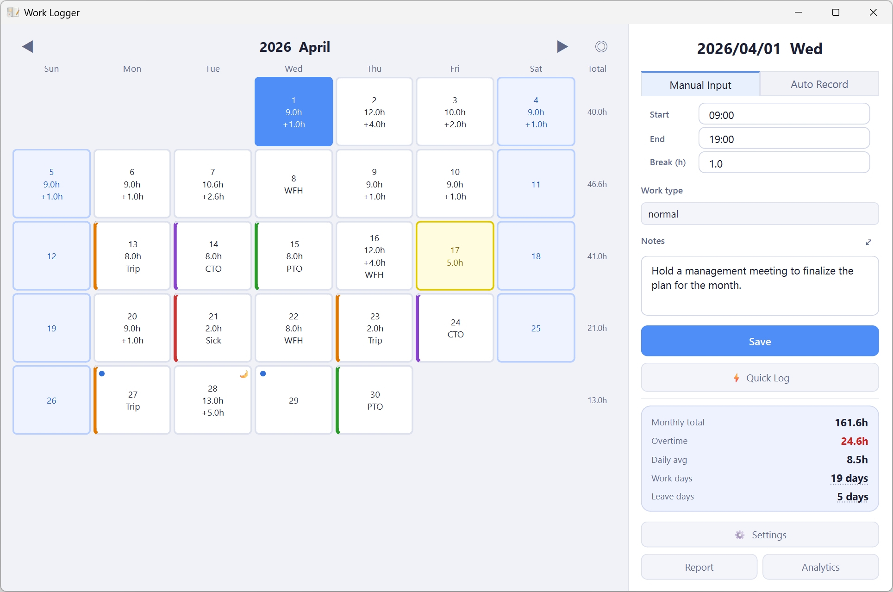

# WorkLogger


WorkLogger is a privacy-first desktop app for tracking work hours, notes, quick logs, reminders, and AI-assisted reports in multiple languages.



## Highlights

- Desktop-first workflow built with PySide6
- An on-device AI-driven report generation system
- Manual Input and Auto Record modes for different logging styles
- Daily tracking with start, end, break, notes, and work type
- Quick Log support for detailed daily activity capture
- Notes-only reminders for future plans or unscheduled work
- Daily, weekly, and monthly reports with built-in and custom templates
- Theme, language, holiday, and reminder display controls
- Windows tray icon and macOS menu bar residency options
- Calendar import, public holiday display, and analytics with monthly targets
- Local SQLite storage with no cloud dependency by default
- Compatible with Anthropic and OpenAI-compatible AI APIs

## Download

Release packages are published through GitHub Releases:

- Windows: `WorkLogger.exe`
- macOS: `WorkLogger.app`

Build outputs are generated into the `dist/` directory.

## Run From Source

### Requirements

- Python 3.10+
- pip

### Install

```bash
pip install -r requirements.txt
```

### Start the app

```bash
python -m worklogger.main
```

## Build

### Windows

```powershell
WorkLogger_build.bat
```

### macOS / Linux

```bash
./WorkLogger_build.sh
```

Both scripts use `worklogger.spec`. The generated executable and packaged artifacts are expected in `dist/`. If you create a macOS App, place the final `.app` file in `dist/` as well.

## i18n Workflow

WorkLogger uses gettext catalogs under `worklogger/locales`.

- Template extraction (`messages.pot`):
```bash
python scripts/i18n_extract.py
```
- Sync language catalogs (`messages.po`):
```bash
python scripts/i18n_sync.py
```
- Compile binary catalogs (`messages.mo`):
```bash
python scripts/i18n_compile.py
```
- CI/local validation:
```bash
python scripts/i18n_check.py
```

`messages.mo` files are generated artifacts and ignored by git. Missing translations automatically fall back to English at runtime.

## Project Layout

```text
worklogger/
  assets/        Application icons
  config/        Constants and themes
  core/          Time parsing and calculation logic
  data/          SQLite persistence layer
  models/        Local models
  services/      AI, export, and calendar services
  stores/        Setting, state
  templates/     Built-in and custom report templates
  ui/            Main window, dialogs, and widgets
  utils/         Shared helpers (including i18n runtime)
docs/
  images/        README and documentation images
dist/            Local build output directory
```

## Data Storage

WorkLogger stores data in a local SQLite database named `worklog.db`. In packaged builds, the database is created next to the executable. User-created custom templates and local app settings are also stored locally.

## Current Features

- Manual Input tab for typing start, end, and break values directly
- Auto Record tab for one-click start, end, and break tracking
- Break resume prompt with restart or continue options
- Notes editor with template insertion and quick-log insertion
- Quick Log list for lightweight daily activity capture
- Windows tray residency and macOS menu bar residency settings
- Built-in and custom templates, plus shipped custom-template sample JSON
- AI settings for primary and secondary providers
- About page with update check and a multilingual feature overview dialog

## Contributing

Contributions are welcome. Please read [CONTRIBUTING.md](CONTRIBUTING.md) before opening a pull request.

## Security

If you find a security issue, please follow the instructions in [SECURITY.md](SECURITY.md).

## License

This project is licensed under [GPL-3.0-or-later](LICENSE).
